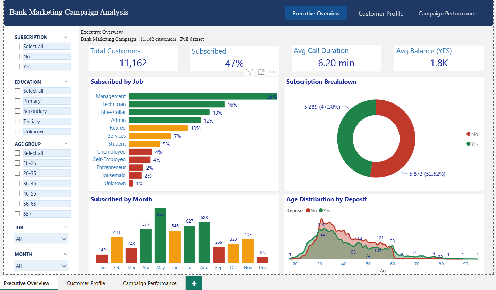
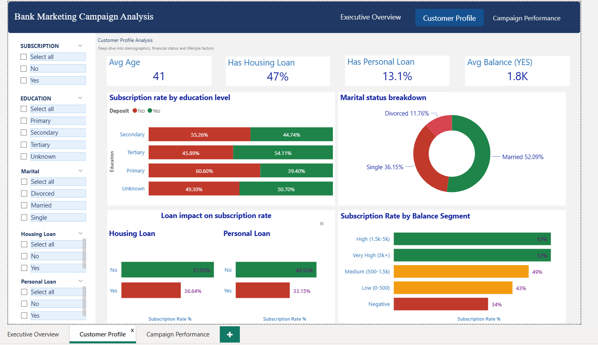
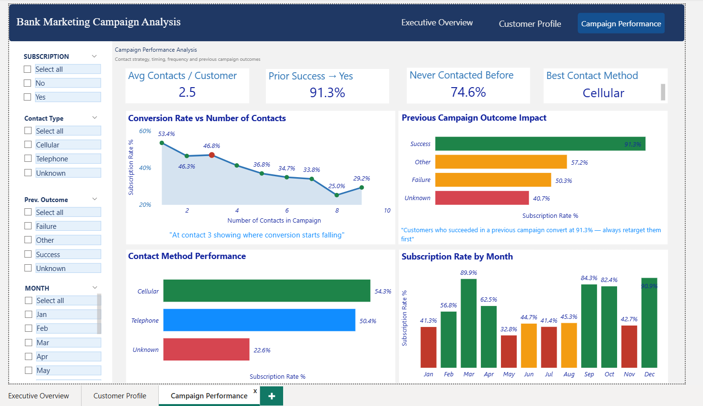

# 🏦 Bank Marketing Campaign Analysis
### Driving Smarter Customer Targeting & Campaign Performance Through Data Analytics


---

## 📖 Project Overview

Financial institutions invest heavily in marketing campaigns to attract customers to term deposit products. However, inefficient targeting and excessive customer outreach can lead to increased costs and lower campaign effectiveness.

This project analyzes a real-world bank marketing dataset containing over **11,000 customer records** to identify the factors that influence customer subscription behavior and provide data-driven recommendations to improve campaign performance.

Using **Python** for data preparation and exploratory analysis and **Power BI** for visualization, this project transforms raw customer data into actionable business insights.

---

## 🎯 Business Objective

The primary objective of this project is to answer the following business questions:

- Which customers are most likely to subscribe to a term deposit?
- How does campaign frequency impact conversion rates?
- Which communication channels are most effective?
- What customer characteristics drive successful conversions?
- How can the bank optimize future marketing campaigns?

---

## 📊 Dataset Overview

The dataset contains customer demographic, financial, and campaign-related information.

### Key Variables

| Category | Features |
|-----------|-----------|
| Demographics | Age, Job, Marital Status, Education |
| Financial Information | Balance, Housing Loan, Personal Loan, Default Status |
| Campaign Information | Contact Type, Campaign Contacts, Contact Duration |
| Historical Performance | Previous Contacts, Previous Campaign Outcome |
| Target Variable | Deposit Subscription (Yes / No) |

### Dataset Size

- **11,162 Customers**
- **17 Features**
- **Binary Classification Target:** Deposit Subscription

---

## 🛠️ Tools & Technologies

### Data Analysis
- Python
- Pandas
- NumPy
- Matplotlib

### Business Intelligence
- Power BI

### Development Environment
- Jupyter Notebook

---

# 🔧 Data Preparation

The dataset underwent several preprocessing steps to ensure data quality and analytical accuracy.

### Data Cleaning

- Removed currency symbols from balance values
- Converted data types
- Validated categorical variables
- Checked for duplicates
- Identified unknown values
- Created derived analytical features

### Feature Engineering

Additional business-focused features were created, including:

- Age Groups
- Balance Segments
- Customer Financial Categories
- Campaign Performance Metrics

---

# 📈 Exploratory Data Analysis

The analysis was conducted across three major business areas:

## 1️⃣ Customer Profile Analysis

Understanding customer demographics and financial behavior.

### Focus Areas

- Age Distribution
- Occupation Analysis
- Education Levels
- Loan Ownership
- Balance Segmentation

---

## 2️⃣ Campaign Performance Analysis

Evaluating campaign effectiveness and communication strategies.

### Focus Areas

- Contact Method Performance
- Campaign Frequency Impact
- Monthly Campaign Trends
- Call Duration Analysis

---

## 3️⃣ Historical Customer Behavior

Analyzing how previous interactions affect future conversion.

### Focus Areas

- Previous Campaign Success
- Historical Contact Frequency
- Customer Retention Potential

---

# 📊 Dashboard Overview

The Power BI dashboard was designed to support business decision-making through three interactive pages.

---

## 📌 Page 1 — Executive Overview

Provides a high-level summary of campaign performance.

### Key Metrics

- Total Customers
- Conversion Rate
- Average Balance
- Average Call Duration
- Subscription Trends

### Insights

- Customer distribution by occupation
- Subscription rate by age group
- Monthly conversion trends

---

## 📌 Page 2 — Customer Profile Analysis

Analyzes customer demographics and financial characteristics.

### Insights

- Education impact on subscription
- Balance segmentation performance
- Housing loan influence
- Personal loan influence

---

## 📌 Page 3 — Campaign Performance Analysis

Evaluates campaign effectiveness and customer engagement.

### Insights

- Contact method effectiveness
- Optimal number of campaign contacts
- Previous campaign outcomes
- Customer response patterns

---

# 🔍 Key Business Insights

## 💰 High-Balance Customers Are More Likely to Subscribe

Customers with higher account balances consistently demonstrate stronger conversion rates.

### Business Implication

Focus future campaigns on financially active customers to maximize returns.

---

## 📞 More Contacts Do Not Increase Success

Campaign effectiveness peaks at approximately **2–3 contacts**.

Beyond this point, conversion rates decline significantly.

### Business Implication

Reduce excessive outreach to lower campaign costs and avoid customer fatigue.

---

## 🔁 Previous Success Predicts Future Success

Customers who previously responded positively to marketing campaigns achieved approximately **91% conversion rates**.

### Business Implication

Prioritize these customers in future marketing initiatives.

---

## 📱 Cellular Communication Outperforms Other Channels

Cellular contact methods generated the strongest performance compared to alternative communication channels.

### Business Implication

Allocate more campaign resources to cellular outreach.

---

## 💳 Loan Ownership Negatively Impacts Conversion

Customers with active personal or housing loans were generally less likely to subscribe to term deposits.

### Business Implication

Develop separate marketing strategies for loan-holding customers.

---

# 🚀 Strategic Recommendations

Based on the findings, the following actions are recommended:

## 🎯 Improve Customer Targeting

Prioritize:

- High-balance customers
- Customers without active loans
- Previously successful customers

---

## 📞 Optimize Campaign Frequency

- Limit customer outreach to 2–3 contacts
- Reduce unnecessary follow-up attempts

---

## 📱 Focus on High-Performing Channels

- Increase investment in cellular campaigns
- Reduce reliance on lower-performing communication methods

---

## 🔁 Leverage Historical Success

Create dedicated retention and upselling campaigns for customers with positive previous outcomes.

---

# 📈 Expected Business Impact

Implementing these recommendations can potentially:

✅ Increase conversion rates

✅ Improve campaign ROI

✅ Reduce marketing costs

✅ Enhance customer targeting efficiency

✅ Improve resource allocation


---

# 📸 Dashboard Preview

## Executive Dashboard



---

## Customer Profile Dashboard



---

## Campaign Performance Dashboard



---

# 📂 Repository Structure

```text
bank-marketing-campaign-analysis/
│
├── 📁 data/
│   └── bank__1_.csv
│
├── 📁 python/
│   ├── bank_campaign_EDA.py
│   ├── fig1_overview_dashboard.png
│   ├── fig2_job_campaign_analysis.png
│   └── fig3_financial_analysis.png
│
├── 📁 sql/
│   └── bank_campaign_queries.sql
│
├── 📁 powerbi/
│   ├── bank_campaign_dashboard.pbix
│   ├── page1_executive_overview.png
│   ├── page2_customer_profile.png
│   └── page3_campaign_performance.png
│
├── 📁 reports/
│   ├── Bank_Marketing_Campaign_Report.pdf
│   ├── SQL_Portfolio_Bank_Campaign.pdf
│   └── Bank_Marketing_Case_Study.html
│
└── README.md
```

---

# 🎓 Skills Demonstrated

- Data Cleaning & Preparation
- Exploratory Data Analysis (EDA)
- Business Intelligence Development
- Dashboard Design
- Data Storytelling
- Marketing Analytics
- Customer Segmentation
- Business Recommendation Development

---

# 👨‍💻 Author

### Mansour Meshwady

**Data Analyst | Business Intelligence Analyst**

📧 mansourmishwady@gmail.com

🌐 LinkedIn: https://www.linkedin.com/in/mansour-meshwady-4ab5a027b

---

### ⭐ If you found this project valuable, consider giving it a star and connecting with me on LinkedIn.
